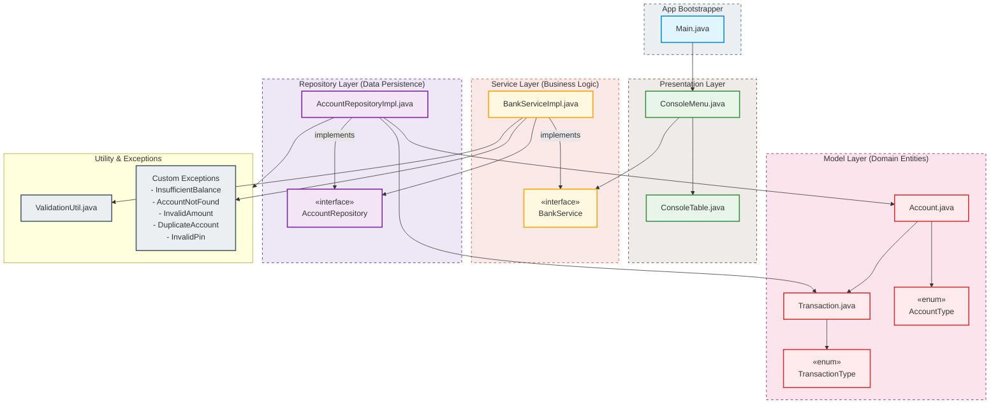
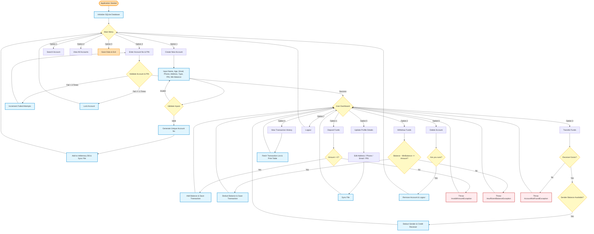

# Bank Management System 🏦

A professional, enterprise-grade Core Java terminal-based application implementing a **Layered Architecture**. This system demonstrates the rigorous application of Object-Oriented Programming (OOP) principles, SOLID design standards, robust file-based persistence, custom exception handling, and streams API. It is tailored for campus placement portfolios (TCS, Cognizant, Infosys, Wipro, Accenture, Deloitte, etc.).

---

## 📖 Project Overview

The **Bank Management System** provides secure, terminal-based banking solutions. The application handles accounts creation, secure authentication, financial transactions (deposits, withdrawals, and bank transfers), transaction logging, data sorting, and robust file operations without relying on external databases.

### 🌟 Key Highlights
- **100% Core Java:** Built using standard library constructs with Java 17 features (compatible down to Java 8).
- **SQLite SQL Database Persistence:** Uses JDBC to communicate with an embedded, zero-configuration local database file (`bank.db`).
- **Layered Architecture:** Enforces separation of concerns by segregating Presentation (Menu), Business Logic (Service), Persistence (Repository), and Domain Models.
- **Visual Terminal Tables:** Displays sorted queries, account summaries, and transaction logs using custom terminal table formatters.

---

## 🛠️ Architecture & System Design

The project strictly follows a **Layered Architecture** pattern to guarantee decoupling, high testability, and clear separation of concerns.

### 🔄 Relationship & Dependency Diagram

The diagram below shows how the components interact across different architectural boundaries:



---

## 🚦 Interactive Flowchart (User Journey)

The interactive logic flow shows the lifecycle of the application, starting from loading system data to processing user commands:



---

## ✨ Features Checklist

| Module | Sub-feature | Description / Validation | Status |
| :--- | :--- | :--- | :---: |
| **System** | SQLite Persistence | Auto-loads/saves account and transaction data automatically from/to local SQL tables. | `Planned` |
| **Account** | Create Account | Generates 10-digit unique numbers. Fields: Name, Age, Email, Gender, Phone, Address, Type, Balance, PIN. | `Planned` |
| **Auth** | Login | Account Number + PIN. Locks account on **3 consecutive incorrect attempts**. | `Planned` |
| **Transactions** | Deposit | Validates positive amount, logs transaction. | `Planned` |
| | Withdraw | Prevents overdraft, maintains minimum balance guidelines, logs transaction. | `Planned` |
| | Transfer | Atomically deducts sender, credits receiver, validates receiver. Logs transactions. | `Planned` |
| | History | Tabular print with Date, Time, Type, Amount, and Running Balance. | `Planned` |
| **Management** | Search | Search records by Account Number, Name, or Phone using Java Streams. | `Planned` |
| | Update | Edit Phone, Email, Address, or PIN. | `Planned` |
| | Delete | Confirmation prompt. Removes record and triggers auto-save. | `Planned` |
| | View All | Displays accounts in tabular structure. Multi-sorting using Custom `Comparators`. | `Planned` |

---

## 🧩 Java Concepts Applied

- **OOP Paradigms:**
  - **Encapsulation:** Class variables in `Account` are private and managed using getters, setters, and state-modifying methods.
  - **Inheritance & Polymorphism:** Implementation of interface models (`AccountRepositoryImpl` implements `AccountRepository`).
  - **Abstraction:** Hiding storage complexity through clean interfaces.
- **Custom Exception Handling:** Built specialized exception classes extending `Exception` to signal application-specific validation failures.
- **Java Collections & Streams:** Used `ArrayList` and `HashMap` for storing and managing accounts. Heavy reliance on Java Streams API for filtering, searching, and sorting records.
- **Modern Java API:** Used `LocalDate` and `LocalDateTime` for handling creation times and transactions timestamps.
- **Database Persistence & JDBC:** Employs JDBC drivers and SQLite databases. Uses `PreparedStatement`, transactions (`commit`/`rollback`), connection management, and SQL query syntax.

---

## 🗂️ Project Directory Structure

```text
BankManagementSystem/
│
├── README.md
├── pom.xml
├── .gitignore
├── LICENSE
├── src/
│   ├── main/
│   │   ├── java/
│   │   │   └── com/
│   │   │       └── bank/
│   │   │           ├── app/
│   │   │           │   └── Main.java
│   │   │           ├── exception/
│   │   │           │   ├── AccountNotFoundException.java
│   │   │           │   ├── DuplicateAccountException.java
│   │   │           │   ├── InsufficientBalanceException.java
│   │   │           │   ├── InvalidAmountException.java
│   │   │           │   └── InvalidPinException.java
│   │   │           ├── menu/
│   │   │           │   └── ConsoleMenu.java
│   │   │           ├── model/
│   │   │           │   ├── Account.java
│   │   │           │   ├── AccountType.java
│   │   │           │   ├── Transaction.java
│   │   │           │   └── TransactionType.java
│   │   │           ├── repository/
│   │   │           │   ├── AccountRepository.java
│   │   │           │   └── AccountRepositoryImpl.java
│   │   │           ├── service/
│   │   │           │   ├── BankService.java
│   │   │           │   └── BankServiceImpl.java
│   │   │           └── utility/
│   │   │               ├── ConsoleTable.java
│   │   │               ├── DatabaseUtil.java
│   │   │               └── ValidationUtil.java
│   │   └── resources/
```

---

## 🚀 How to Run

### Prerequisites
- JDK 17 (or newer)
- Apache Maven

### Installation & Execution
1. Clone the repository:
   ```bash
   git clone https://github.com/sajidtecho/Bank-Management-System.git
   cd Bank-Management-System
   ```
2. Build the project:
   ```bash
   mvn clean compile
   ```
3. Run the application:
   ```bash
   mvn exec:java
   ```

---

## 🔮 Future Enhancements
- Upgrade to client-server RDBMS databases (MySQL/PostgreSQL) or configure Spring Data JPA.
- Build a graphical user interface (GUI) using JavaFX or a Web Dashboard using Spring Boot and Thymeleaf.
- Secure customer PINs using hash algorithms (e.g., BCrypt).
- Introduce multi-currency accounts and loan interest rate calculation modules.

---

## 🎓 Learning Outcomes
- Advanced understanding of **Layered Architectures** in Java.
- Implementing database-handling techniques using SQL and JDBC while preserving transactional safety.
- Hand-on experience resolving design rules using SOLID and Clean Coding standards.
- Practiced parsing objects to strings (serialization) and reading strings back into object instances (deserialization).
